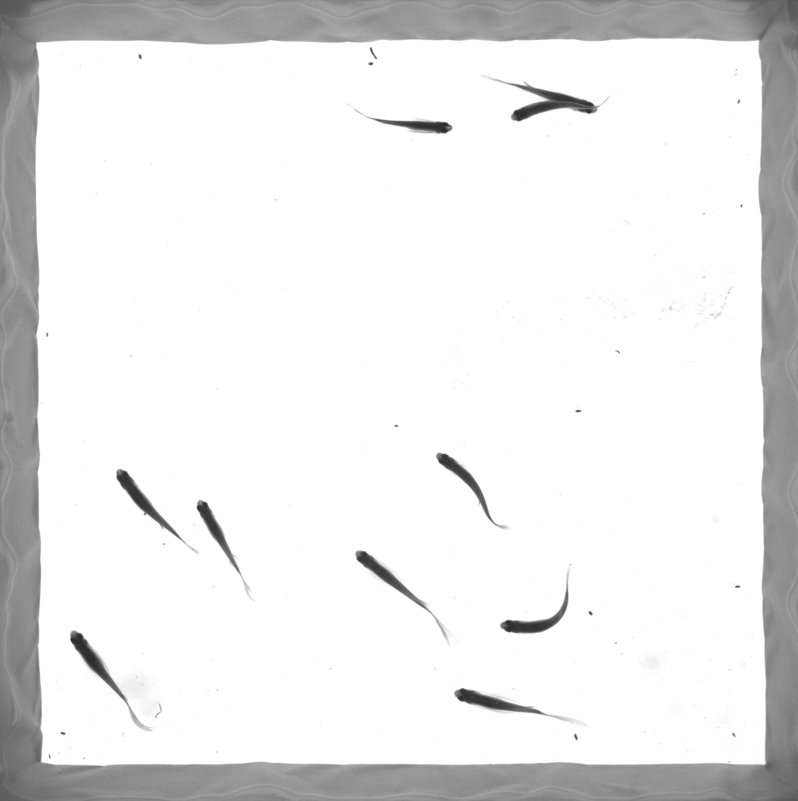
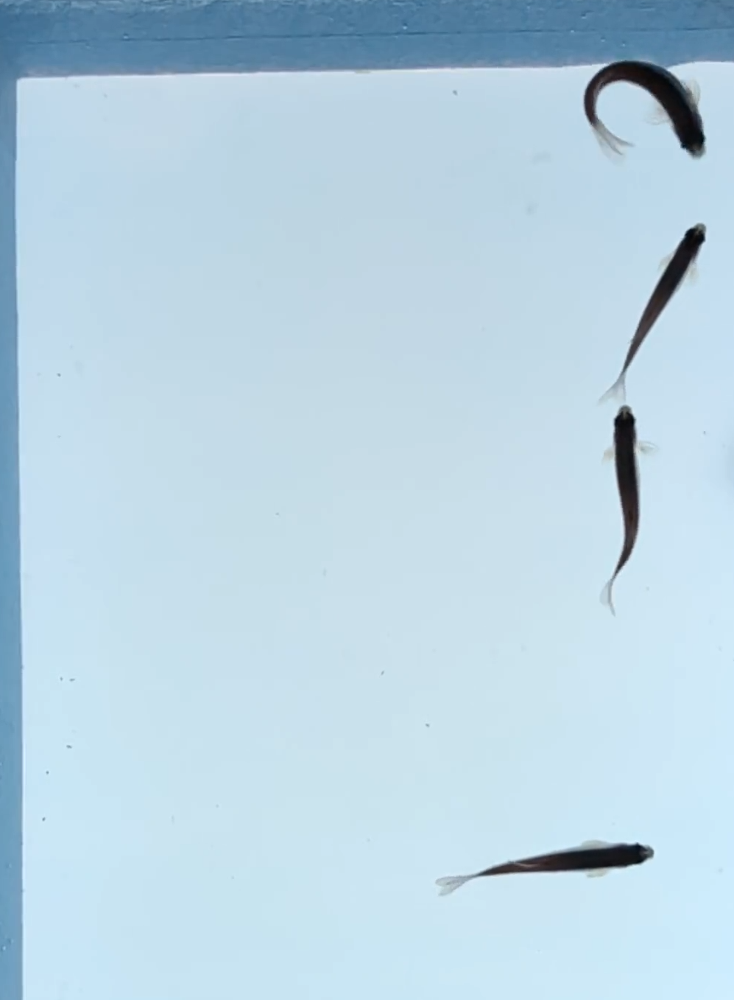

# Tracking Zebrafish (Yolov7 + StrongSORT)


<div align="center">
<p>
  
</p>
</div>


## Introduction

這個分支主要是在處理斑馬魚追蹤，並提取出相關的運動特徵。

**主要修改部分**:

新增 extract_feature.py, build_skeleton_module.py, img_preprocess.py 檔案.(請參照paper流程圖)

## Before you run the tracker

Make sure that you fulfill all the requirements: Python 3.8 or later with all [requirements.txt](https://github.com/mikel-brostrom/Yolov7_DeepSort_Pytorch/blob/master/requirements.txt) dependencies installed, including torch>=1.7. To install, run:

`pip install -r requirements.txt`

## Tracking setting example
```bash
--img-size
1376
--yolo-weights
yolov7/runs/base_model/exp9-normal-anchor/weights/best.pt
--source
Videos/IMG_2603.mp4
--device
1
--show-vid
--save-txt
--save-vid
```
## Tracking sources

Tracking can be run on most video formats

```bash
$ python track.py --source 0  # webcam
                           img.jpg  # image
                           vid.mp4  # video
                           path/  # directory
                           path/*.jpg  # glob
                           'https://youtu.be/Zgi9g1ksQHc'  # YouTube
                           'rtsp://example.com/media.mp4'  # RTSP, RTMP, HTTP stream
```


## Select object detection and ReID model

### Yolov7

There is a clear trade-off between model inference speed and accuracy. In order to make it possible to fulfill your inference speed/accuracy needs
you can select a Yolov7 family model for automatic download

```bash


$ python track.py --source 0 --yolo-weights yolov7.pt --img 640
                                            yolov7x.pt --img 640
                                            yolov7-e6e.pt --img 1280
                                            ...
```

### StrongSORT

The above applies to StrongSORT models as well. Choose a ReID model based on your needs from this ReID [model zoo](https://kaiyangzhou.github.io/deep-person-reid/MODEL_ZOO)

```bash


$ python track.py --source 0 --strong-sort-weights osnet_x0_25_market1501.pt
                                                   osnet_x0_5_market1501.pt
                                                   osnet_x0_75_msmt17.pt
                                                   osnet_x1_0_msmt17.pt
                                                   ...
```

## MOT compliant results

Can be saved to your experiment folder `runs/track/<yolo_model>_<deep_sort_model>/` by 

```bash
python track.py --source ... --save-txt
```


## Cite

If you find this project useful in your research, please consider cite:

```latex
@misc{yolov7-strongsort-osnet-2022,
    title={Real-time multi-camera multi-object tracker using YOLOv7 and StrongSORT with OSNet},
    author={Mikel Broström},
    howpublished = {\url{https://github.com/mikel-brostrom/Yolov7_StrongSORT_OSNet}},
    year={2022}
}
@lx-cly{yolov7-obb-2022,
    title={YOLOv7_OBB},
    author={lx-cly},
    howpublished = {\url{https://github.com/lx-cly/YOLOv7_OBB}},
    year={2022}
}
```

## Contact 

For Yolov7 DeepSort OSNet bugs and feature requests please visit [GitHub Issues](https://github.com/mikel-brostrom/Yolov7_StrongSORT_OSNet/issues). For business inquiries or professional support requests please send an email to: yolov5.deepsort.pytorch@gmail.com
